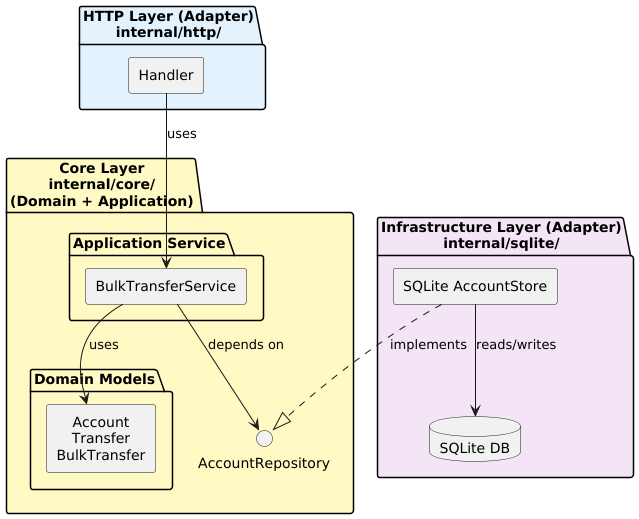
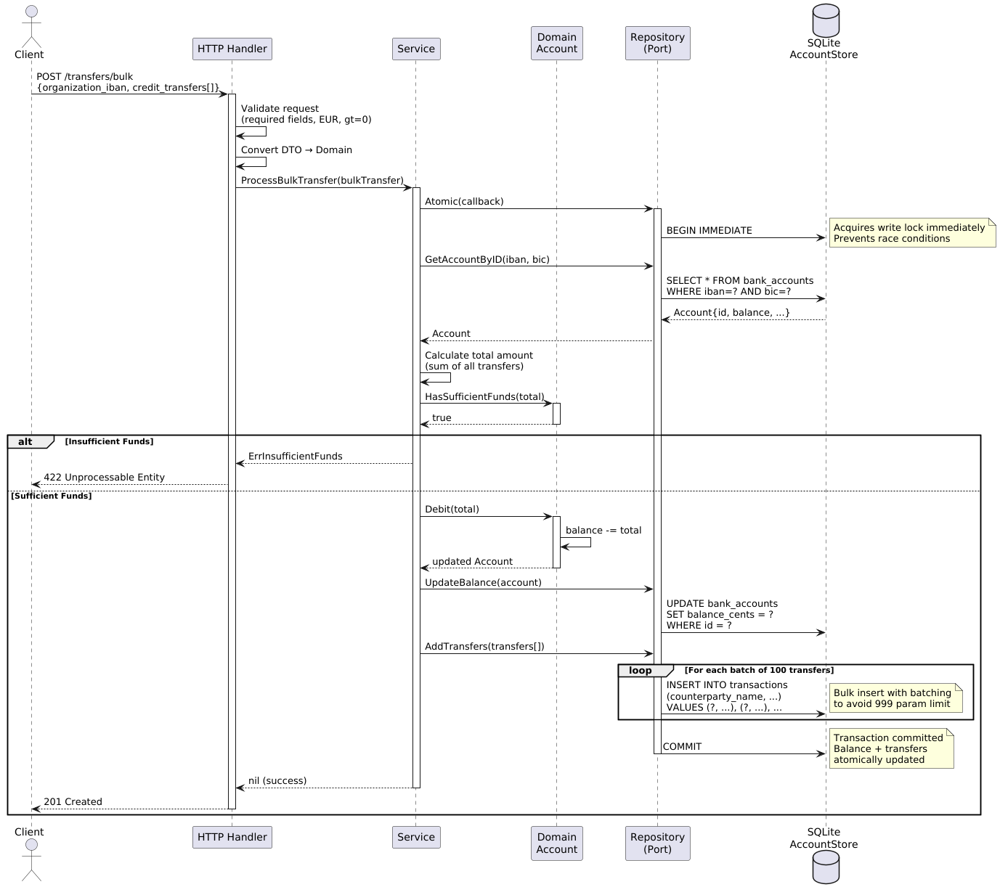

# Bulk Transfer Payment Service

## Summary

This service processes bulk money transfers for banking customers, ensuring atomic operations across balance updates and transaction records. Built with **hexagonal architecture** in Go, it provides strong ACID guarantees through SQLite's transaction isolation while maintaining comprehensive test coverage (unit, integration, and end-to-end). The implementation prioritizes **correctness and testability** over premature optimization, with clear separation between domain logic, infrastructure concerns making it straightforward to evolve toward production requirements.

---

## Quick Start

```bash
# 1. Start the service
make local-run

# 2. Test it (in another terminal)
curl -X POST http://localhost:8080/transfers/bulk \
  -H "Content-Type: application/json" \
  -d '{
    "organization_bic": "OIVUSCLQXXX",
    "organization_iban": "FR10474608000002006107XXXXX",
    "credit_transfers": [{
      "amount": "99.50",
      "currency": "EUR",
      "counterparty_name": "Acme Corp",
      "counterparty_bic": "CMCIFRPP",
      "counterparty_iban": "FR7630006000011234567890189",
      "description": "Invoice #123"
    }]
  }'

# Expected: 201 Created (success)
# Or: 422 Unprocessable Entity (insufficient funds)
# Or: 404 Not Found (account not found)
# Or: 400 Bad Request (validation error)

curl -X POST http://localhost:8080/transfers/bulk \
  -H "Content-Type: application/json" \
  -d @docs/sample1.json
```

---

## Table of Contents

- [Quick Start](#quick-start)
- [Architecture Overview](#architecture-overview)
  - [Hexagonal Architecture](#hexagonal-architecture-ports--adapters)
  - [Key Design Decisions](#key-design-decisions)
  - [Data Flow](#data-flow-successful-bulk-transfer)
- [Getting Started](#getting-started)
  - [Prerequisites](#prerequisites)
  - [Running the Service](#running-the-service)
  - [Configuration](#configuration)
  - [Testing](#testing)
- [Testing Strategy](#testing-strategy)
- [What I'd Do Differently in Production](#what-id-do-differently-in-production)

---

## Architecture Overview

### Hexagonal Architecture (Ports & Adapters)

This service follows hexagonal architecture to achieve **domain isolation** and **testability**. The domain logic remains independent of infrastructure concerns (HTTP, database), making it easy to test and evolve.

Financial transactions require rigorous testing and the ability to evolve infrastructure choices (SQLite -> PostgreSQL) without touching business logic. Hexagonal architecture makes the domain logic unit-testable with mocks, allows the repository implementation to be integration-tested separately, and enables end-to-end testing of the full stack. This separation of concerns is critical for correctness in financial systems.



**Component Layers:**

- **HTTP Layer** (`internal/http/`) - Primary Adapter: Handles HTTP requests, validates input, maps errors
- **Core Layer** (`internal/core/`) - Domain + Application: 
  - **Domain Models** (`models.go`): Account, Transfer, BulkTransfer with business logic
  - **Application Service** (`service.go`): Orchestrates business operations
  - **Repository Port** (`repository.go`): Interface defining persistence contract
- **Infrastructure Layer** (`internal/sqlite/`) - Secondary Adapter: Concrete repository implementation

**Note:** In this implementation, `internal/core/` encapsulates both the domain layer (models, business rules) and the application layer (service orchestration). This keeps the core business logic isolated and highly testable.

### Key Design Decisions

| Decision | Rationale | Trade-offs                                                                                                                                                                                                                                                                                              |
|----------|-----------|---------------------------------------------------------------------------------------------------------------------------------------------------------------------------------------------------------------------------------------------------------------------------------------------------------|
| **Hexagonal Architecture** | Domain isolation enables easy testing with mocks. Business logic remains pure, independent of HTTP/DB concerns. | More boilerplate (interfaces, DTOs), but gains testability and flexibility.                                                                                                                                                                                                                             |
| **Repository Pattern** | Single `AccountRepository` interface abstracts database operations. Easy to swap SQLite → PostgreSQL. | Could split into separate repositories per aggregate, but single repository simplifies atomic operations.                                                                                                                                                                                               |
| **`BEGIN IMMEDIATE` Transactions** | SQLite always uses SERIALIZABLE isolation, but lock timing matters. BEGIN IMMEDIATE acquires a RESERVED lock at transaction start and holds it for the entire transaction duration, blocking other write transactions immediately while still allowing concurrent reads (with WAL mode). This prevents "check-then-act" race conditions. | BEGIN DEFERRED allows concurrent transactions to read stale data before acquiring write lock, enabling "check-then-act" race condition. BEGIN EXCLUSIVE would block readers unnecessarily. BEGIN IMMEDIATE serializes writers from the start, eliminating the race window entirely.                     |
| **SQLite with WAL Mode + Busy Timeout** | WAL allows concurrent reads during writes. `_busy_timeout=30s` makes SQLite retry lock acquisition automatically instead of failing immediately with `SQLITE_BUSY`. | SQLite serializes writes globally (database-level lock). Fine for single application instance, but will not scale for multiple app servers. PostgreSQL offers row-level locking, allowing concurrent writes to different accounts, better suited for horizontal scaling with multiple service instances. |
| **Integer Arithmetic (Cents)** | All monetary calculations use integer arithmetic in cents (e.g., €10.50 = 1050 cents). Avoids floating-point precision errors inherent in financial calculations. API strings are parsed to integers at the boundary. | Considered using decimal library (e.g., shopspring/decimal) for exact decimal arithmetic, but parsing strings to string->float->int is simpler and sufficient since we only handle 2 decimal places (cents).                                         |
| **Outgoing Transfers Only** | PRD specifies positive amounts in API (`"amount": "100.50"`). Service implements debits only (money leaving organization accounts). Stored as negative values in DB (`-10050` cents) per accounting conventions. Sign inversion happens at repository boundary. |
| **Validation at Boundaries** | HTTP layer validates format/required fields, domain layer validates business rules. | Clear separation: HTTP catches malformed requests, domain catches business violations.                                                                                                                                                                                                                  |

### Data Flow: Successful Bulk Transfer



**Key Steps:**
1. HTTP request validation (required fields, EUR, positive amounts)
2. DTO → Domain conversion
3. **BEGIN IMMEDIATE** (acquire write lock immediately)
4. Fetch account by IBAN/BIC
5. Validate business rule: `HasSufficientFunds(total)`
6. Debit account balance
7. Bulk insert transfers
8. **COMMIT** transaction (atomic: balance + transfers)
9. Return 201 Created


---

## Getting Started

### Prerequisites

- **Go 1.24.6+**
- **CGO enabled** (required for SQLite driver)
- **Make** (optional, for convenience commands)

### Running the Service

```bash
# Start the service with default configuration
make local-run

# The service will start on http://localhost:8080
```

### Configuration

| Variable | Default | Description |
|----------|---------|-------------|
| `DATABASE_PATH` | `payment_accounts.sqlite` | SQLite database file path |
| `HTTP_ADDRESS` | `localhost:8080` | HTTP server address |
| `HTTP_TIMEOUT` | `10s` | HTTP server request timeout |
| `LOG_LEVEL` | `-4` (Info) | Log level: -4=Info, 0=Warn, 4=Error |
| `MAX_OPEN_CONNS` | `25` | Maximum open database connections |
| `MAX_IDLE_CONNS` | `5` | Maximum idle database connections |
| `CONN_MAX_LIFETIME` | `5m` | Maximum connection lifetime |
| `CONN_MAX_IDLE_TIME` | `1m` | Maximum connection idle time |
| `BUSY_TIMEOUT` | `30s` | SQLite busy timeout (lock wait time) |
| `ENABLE_WAL` | `true` | Enable SQLite WAL mode |


### Testing

```bash
# Run unit tests
make unit_test

# Run integration tests
make integration_test

# View coverage
go tool cover -html=unit_coverage.out
go tool cover -html=int_coverage.out
```

---


## Testing Strategy

This project follows a **three-tier testing approach**: unit tests, integration tests, and end-to-end tests. Each layer validates different aspects of the system.

### Test Architecture

```
┌─────────────────────────────────────────────┐
│ E2E Tests (test/http/)                      │
│ Full stack: HTTP → Service → SQLite         │
│ Real database, real HTTP handlers           │
└─────────────────────────────────────────────┘
                    ↓
┌─────────────────────────────────────────────┐
│ Integration Tests (test/components/sqlite/) │
│ Service → SQLite (real database)            │
│ Tests repository implementation             │
└─────────────────────────────────────────────┘
                    ↓
┌─────────────────────────────────────────────┐
│ Unit Tests (internal/*_test.go)             │
│ Domain logic with mocks                     │
│ Tests business rules in isolation           │
└─────────────────────────────────────────────┘
```

---

## What I'd Do Differently in Production

This implementation prioritizes **correctness and testability** for a technical assessment. A production system would require additional considerations for **reliability, observability, and scale**.

| Aspect | This Implementation | Production System                      |
|--------|---------------------|----------------------------------------|
| **Database** | SQLite (single writer) | PostgreSQL (row-level locks) + indeces |
| **Idempotency** | ❌ Not implemented | ✅ Required (idempotency keys)          |
| **Observability** | Basic logging | Metrics, traces, structured logs       |
| **Auth** | ❌ None | ✅ JWT + RBAC                           |
| **Rate Limiting** | ❌ None | ✅ Per-organization limits              |
| **Error Handling** | Direct propagation | Retries, circuit breakers              |
| **Deployment** | Binary | Docker + Kubernetes                    |
| **Migrations** | Manual schema | Automated (golang-migrate)             |
| **Security** | Basic (parameterized queries) | TLS, audit logs, encryption            |

**Key Principle:** This implementation demonstrates **architectural discipline** and **correctness**. Production requires additional layers for **reliability at scale**, but the **hexagonal architecture** makes these additions straightforward without rewriting core logic.

---

